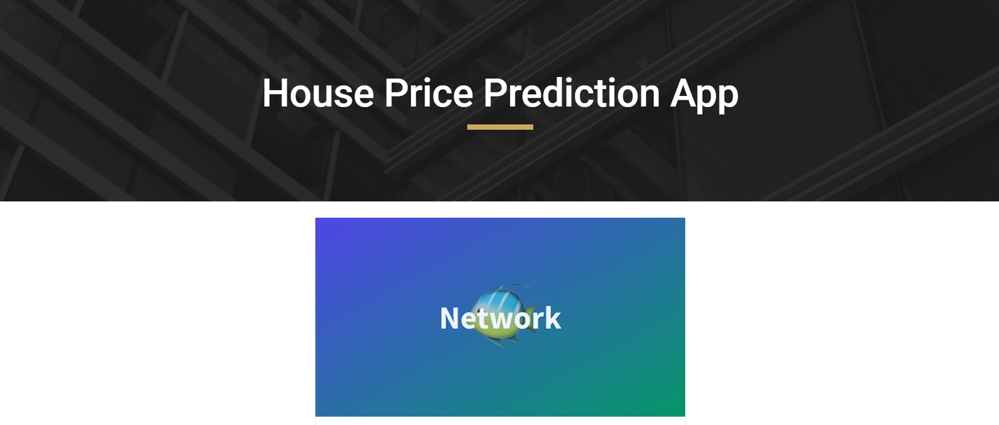

# House Price Predictor

## Overview
This Python script employs the Streamlit library to create an interactive web app for predicting house prices. It utilizes machine learning models, specifically the LightGBM regressor, trained on a dataset with 17 features. The user interface includes sliders for selecting various house features, and upon clicking the "Predict" button, the script calculates and displays the estimated house price. Additionally, it utilizes the SHAP (SHapley Additive exPlanations) library to provide feature importance explanations with bar and summary plots, enhancing interpretability. The resulting web app enables users to dynamically explore and understand the factors influencing house price predictions.
#Daniyal Khan

## Visit the Website Here!

## Language Model
The model that I chose to use to perform the SHAP interpretation of the house price prediction was the xgboost model. This is known as Extreme Gradient Boosting algorithm. For my case, it used a decision tree a checked the difference between the actual and predicted values. In additon to that, it also handled any missing values that occured in the data. The one other feature is does is prevent overfitting. I learned this from [XGBoost Article](https://machinelearningmastery.com/gentle-introduction-xgboost-applied-machine-learning/)

## Calculation from Data
For my shap values, I generated a summary plot consisting of all the features that are int and float data type and they are ordered by their shap values. There are multiples points on the graph and each point is basically an instance in the data. There is also a vertical line included which shows where the most important features are. The blue dots are known as low values and the red dots are known as high values. If you see purple then thats what is in the middle values. Also the horizontal axis shows the SHAP values for each feature.

## Summary Plot

For SHAP Values, I generated another graph known as a waterfall plot which basically shows the effects of a feature to the model which could be positive or negative. If the features line is red, that means the features is going to increase the prediction and a blue line shows that a feature is decreasing the prediction. As you can see in my graph, I am using all the features that are int and float data types. Just know that the Y-axis of the graph is the featuers and the x-axis of graph is the features contribution to that prediction. In my plot, you can see that the 'OverallQual' feature has a major positive effect on the prediction while others not so much.

## Waterfall Plot 

For shap interaction values, I created a dependence plot using the shap library. In this dependance plot, I am extracting one feature in the dataset and will see what effects will do to the models prediction. In my case, I used the 'OverallQual' feature in my dependance plot and I could see the differences it makes to the model's prediction. We are comparing the prediction that has the 'OverallQual' feature with the prediction that does not have the 'OverallQual' Feature. From my plot, we can see that the value of 'OverallQual' feature increases in the plot. This indicates that this feature is an important predictor of the model's output because of the high predictions values it produces.

## Dependance plot

